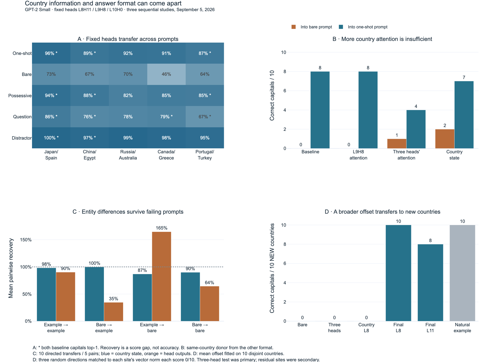

# Country information, circuit recovery, and answer format

September 5, 2026. Three sequential GPT-2 Small studies, each specified before
its own measurements. The first is a primary generalization study; the next
two follow hypotheses suggested by its results. Local prospective plans are
not external preregistrations.

**Main result:** the previously selected capital-city heads transfer strongly
across countries, but recovering the capital-versus-capital logit gap can
coexist with complete failure to produce a capital as the highest-ranked token.
A fixed format-associated vector at the final token before layer 8 changed
bare-prompt accuracy from 0/10 to 10/10 on new countries excluded from fitting.
The primary hypothesis that an average offset in the three selected heads
would suffice failed: 0/10. The successful residual intervention was a
prespecified secondary test. This is a small, controlled pilot, not a claim
of a novel general law or a complete circuit.



[Interactive figure](../visualizations/capital-studies/results.html) ·
[SVG figure](../visualizations/capital-studies/results.svg)

## 1. Fixed heads generalize, with a dependence on wording

Heads L8H11, L9H8, and L10H0 were chosen by the earlier France/Italy experiment.
We did not reselect them. Six country pairs (one calibration, five held-out)
were evaluated in five templates. Every case passed tokenization requirements.
All held-out pairwise baseline gaps exceeded the prespecified two-logit minimum.

For D = logit(capital A) − logit(capital B), define gap = D(A) − D(B):

- Recovery R = [D(B patched from A) − D(B)] / gap.
- Disruption N = [D(A) − D(A patched from B)] / gap.

N is also the reverse-direction restoration score after exchanging the labels.
It is not independent evidence or a proof of global necessity. Joint patches
replace each head with its value from the unmodified donor, even across layers.

The table reports means across the five held-out pairs. Controls are the mean
of three random triples, with one head in each target layer and target heads
excluded. Every cell is available in the CSV and per-case JSON.

| Template | R, final position | R, all positions | N, final position | Control R, final | Both capitals initially top-1 |
|---|---:|---:|---:|---:|---:|
| One-shot | 91.0% | 92.4% | 89.6% | 0.3% | 3/5 |
| Bare | 64.0% | 66.6% | 64.9% | 0.6% | 0/5 |
| Possessive | 86.8% | 92.1% | 86.2% | 0.2% | 3/5 |
| Question–answer | 77.3% | 78.5% | 76.0% | 0.6% | 4/5 |
| Distractor prefix | 97.9% | 98.6% | 97.6% | 0.1% | 2/5 |

On the prespecified competent subset, final-position mean R is 90.9%, 88.9%,
77.2%, and 98.4% for one-shot, possessive, question, and distractor. There is
no competent bare-prompt subset. Therefore, the bare comparison cannot isolate
wording while holding initial task competence fixed.

Country changes matter causally through these fixed heads in every tested
wording. The experiment does **not** establish that the heads alone implement
capital answering. One position explains most of their all-position effect,
but the difference reaches 10.7 percentage points in one possessive case.

Restoration and disruption have similar aggregate values here, which does not
support a strong average asymmetry story for this three-head set. Individual
differences range from −21.1 to +18.9 percentage points. Joint-minus-summed-single
restoration ranges from −15.7 to +9.1 points, so summing separate interventions
is still not exact. Five pairs repeated across templates do not supply 25
independent country-pair samples; no population significance test is claimed.

## 2. Is the weaker bare behavior simply poor attention routing?

L9H8's mean country attention falls from 94.9% with the example to 54.5% without
it. We tested whether this correlation explains the failure by transplanting
only the same country's attention mass from one format into the other. Other
attention probabilities were rescaled proportionally to preserve their sum.
No answer vectors were transplanted in these attention-only interventions.

| Intervention | Bare prompts, correct / 10 | One-shot prompts, correct / 10 |
|---|---:|---:|
| Baseline | 0 | 8 |
| L9H8 country-attention mass from other format | 0 | 8 |
| All three target heads' country-attention masses | 1 | 4 |
| Same-country residual at country position before layer 8 | 2 | 7 |
| Each of three control-head attention triples | 0 | 8 |

Increasing the target heads' attention raised bare mean correct-token
probability from 0.59% to 1.52%, but rescued only Greece/Athens as top-1.
The whole country-state transplant raised it to 4.33%, rescuing Spain/Madrid
and Greece/Athens. Reducing all three heads' attention in one-shot prompts
hurt performance. Thus this attention is functionally relevant, but the tested
attention-mass change is insufficient to explain the missing answer behavior.
Whole-state transplants also carry contextual and positional differences.

## 3. Entity-dependent information survives the failing format

Let h(S,A) be a site's activation for country A under format S. In recipient
format T with country B, set the site's activation to

`h(T,B) + [h(S,A) − h(S,B)]`.

This tests whether a country-dependent difference transports across formats.
When S = T it reduces to ordinary donor replacement, which we checked
numerically. For head outputs spanning layers, the recipient term always
comes from the unmodified run. This is an operational transport test, not a
proof that the representations have identical meaning or remain in-distribution.

The table averages ten directed transfers from five pairs. Correctness means
the donor country's capital becomes the top token over the entire vocabulary.

| Donor format → recipient format | Country residual L8: R / correct | Three final head outputs: R / correct |
|---|---:|---:|
| One-shot → one-shot | 98.3% / 8 of 10 | 90.3% / 8 of 10 |
| Bare → one-shot | 99.9% / 8 of 10 | 34.7% / 0 of 10 |
| One-shot → bare | 86.9% / 0 of 10 | **164.8% / 0 of 10** |
| Bare → bare | 90.0% / 0 of 10 | 64.5% / 0 of 10 |

The source-country difference from bare prompts remains usable by the one-shot
recipient. It is therefore too strong to say the bare prompt has lost all
causally useful country information. The reduced transport from final head
outputs places a difference between these two measurement sites, but does not
isolate a single intervening component.

The 164.8% result is a concrete failure case for equating normalized pairwise
recovery with task success. The intervention exceeds the recipient's original
capital-versus-capital gap and still never produces the target capital at rank
one. This occurs despite all denominators passing the two-logit threshold;
it is not a near-zero-denominator artifact.

## 4. A fixed offset predicts answers on ten new countries

We estimated, separately at prespecified sites, a mean format-associated vector:

`v = mean_country[h(one_shot, country) − h(bare, country)]`.

The fitting countries were Japan, Spain, China, Egypt, Russia, Australia,
Canada, Greece, Portugal, and Turkey. Evaluation countries were Denmark,
Norway, Sweden, Finland, Poland, Austria, Hungary, Netherlands, Thailand, and
Peru. All ten evaluation countries and capitals passed tokenization checks;
none were substituted. No evaluation country contributed to the vector.

We added v with fixed scale one to each bare recipient's activation. Target-head
patches use the unmodified recipient output plus v at each of the three layers.
No training, optimization, or per-test-country vector was used.

| Intervention site | Correct / 10 new countries | Mean correct-token probability |
|---|---:|---:|
| Bare baseline | 0 | 0.32% |
| Three target heads, final outputs (**primary**) | 0 | 0.15% |
| Country residual, input to layer 8 | 0 | 3.17% |
| Final residual, input to layer 8 (**secondary**) | **10** | **34.55%** |
| Final residual, input to layer 11 (secondary) | 8 | 20.47% |
| Natural one-shot reference | 10 | 60.63% |

Each of three random directions matched to the component-wise vector norm at
each tested target/residual site scored 0/10. Each of three layer-matched
control-head mean offsets scored 0/10. Target-head offset scales −1, 0, 0.5,
1, and 1.5 all scored 0/10. The zero intervention reproduced the baseline.
All control outcomes, probabilities, and per-country ranks are in the JSON;
the full residual patches change more dimensions than the selected-head patches.

| New country | Bare capital rank | Rank after final-L8 offset | Correct-token probability after offset |
|---|---:|---:|---:|
| Denmark | 106 | 1 | 31.0% |
| Norway | 534 | 1 | 23.7% |
| Sweden | 303 | 1 | 32.9% |
| Finland | 73 | 1 | 50.2% |
| Poland | 10 | 1 | 36.6% |
| Austria | 261 | 1 | 12.9% |
| Hungary | 28 | 1 | 70.6% |
| Netherlands | 40 | 1 | 25.5% |
| Thailand | 38 | 1 | 40.7% |
| Peru | 1128 | 1 | 21.4% |

The narrow three-head offset explanation failed, while a broader residual
offset transferred. This supports a reusable format-associated change beyond
the specific entity-dependent head outputs tested here. It does not identify
its semantic contents. Example presence, extra tokens, absolute positions,
and desired continuation style remain confounded. A bare prompt's preference
for a grammatical continuation such as an article is not evidence that the
model lacks the underlying fact. The outcome is specifically next-token
capital completion, not general knowledge or multi-token QA.

## Relation to existing research and what is potentially useful here

Activation-based task transfer is already established in
[In-Context Learning Creates Task Vectors](https://arxiv.org/abs/2310.15916)
and [Function Vectors in Large Language Models](https://arxiv.org/abs/2310.15213).
The latter also distinguishes function information from merely representing
its output space. We should not present the existence of a transferable vector
as a new discovery. A related line explicitly connects attention heads and
task-vector geometry: [Unifying Attention Heads and Task Vectors](https://arxiv.org/abs/2505.18752).

The factual-recall pipeline is also established:
[Geva et al., Dissecting Recall of Factual Associations](https://aclanthology.org/2023.emnlp-main.751/)
studies subject enrichment and attention-mediated attribute extraction;
[Interpreting Key Mechanisms of Factual Recall](https://arxiv.org/abs/2403.19521)
examines head/MLP interactions on factual queries. Our current interventions
do not settle the division of labor between attention and MLPs.

The useful candidate contribution is a tightly controlled comparison of
**entity-signal transfer, pairwise recovery, and actual task recovery** in the
same circuit, plus a falsified narrow explanation and a held-out prediction.
Determining whether that comparison is novel requires deeper method-level
comparison and stronger controls, not just finding no matching paper title.
The [research goals](../RESEARCH_GOALS.md) define those next steps.

## Verification, resource use, and reproducibility

- Original one-shot baselines and single-head effects matched saved results
  within the predeclared 0.01 tolerance.
- All 120 primary self/full-residual control errors were zero in logit
  difference. Follow-up self/difference-equivalence errors were at most
  1.34e-5, below 1e-4. Attention rows remained normalized. Zero-offset controls
  passed. Source, plan and vector hashes accompany the data.
- One cached GPT-2 Small at a time, CPU float32, two compute threads,
  inference mode, selected caches only, no model downloads. Revision:
  `607a30d783dfa663caf39e06633721c8d4cfcd7e`.
- Model processes took approximately 127, 25, and 23 seconds, with peak RSS
  about 2,342 MiB (2.29 GiB) in each. All exited. Approximately 1,930 forward
  passes total. The watchdog polled a 4-GiB RSS budget, 15-minute deadline,
  and system memory availability; these are monitored limits, not kernel
  guarantees against instantaneous overshoot.

Run sequentially from the repository root:

```bash
.venv/bin/python experiments/capital_generalization.py
.venv/bin/python -I -S experiments/summarize_generalization.py
.venv/bin/python experiments/capital_routing.py
.venv/bin/python experiments/capital_format_transfer.py
.venv/bin/python -S experiments/verify_capital_studies.py
.venv/bin/python experiments/plot_capital_studies.py
```

These commands regenerate their output files. The model scripts share a lock;
the original older sweep/notebooks do not use it. Static figure export uses
the installed Chrome through Kaleido and may need permission to launch it.
Model inference itself ran inside the sandbox.

Artifacts: [primary CSV](../data/generalization/summary.csv),
[primary manifest](../data/generalization/run.json),
[routing/transport data](../data/routing/run.json),
[new-country data](../data/format_transfer/run.json),
[fitted offsets](../data/format_transfer/offsets.json).
