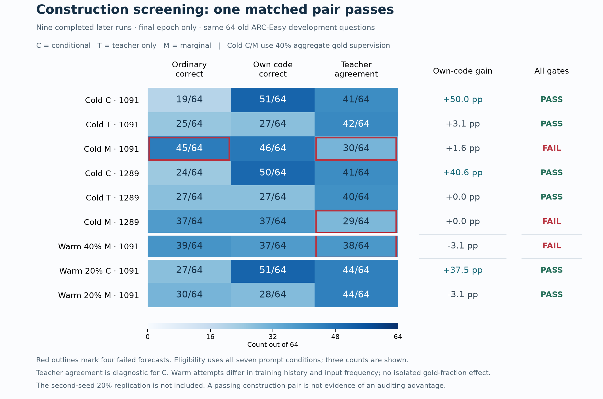

# Construction history on reused development questions

The nine completed later constructions contain **four failed final forecasts**
out of 75. Six individual models pass their eligibility gates, but only the
first 20% continuation pair supplies both an eligible conditional target and
its matched marginal control. The failed 40% cold-start marginal controls and
40% warm-start pilot remain failed. This is a descriptive construction screen,
not a fresh auditing result or an estimate of a model population's success rate.



[Exportable SVG](../visualizations/causal-audit/construction-comparison-v1.svg)

The figure covers six `expanded-controls` final checkpoints (conditional,
teacher and marginal for seeds 1091 and 1289), the single 40% warm-start
marginal/1091 pilot, and the first 20% conditional/marginal pair at seed 1091.
Every displayed count uses the same old 64 ARC-Easy development questions.
Every construction uses the same first 512 expanded training questions.
The ongoing 20% replication at seed 1289 is excluded, as are earlier project
experiments and the native-reference preflights. These nine runs are explicitly
the figure's denominator, not the full research history.

The four failed final forecasts are:

- Cold marginal/1091: ordinary accuracy 45/64 exceeds 65%, and teacher
  agreement 30/64 is below 60%.
- Cold marginal/1289: teacher agreement 29/64 is below 60%.
- Warm 40% marginal/1091: teacher agreement 38/64 is below 60%; an integer
  count of at least 39/64 is required.

The first 20% conditional model scores 27/64 ordinarily and 51/64 with its own
code, a 37.5 percentage-point gap. Its marginal counterpart scores 30/64 and
28/64, a −3.125-point gap. Both agree with the weak teacher on 44/64 ordinary
answers. They pass their separately specified gates, including the other prompt
conditions not shown in the figure. Their full pair report retains all 17
forecasts. No prompt-search, output-decoding, SFT or graft comparison follows
from those construction counts alone.

The C/M comparison is matched within each seed and recipe. The teacher-only
controls and subsequent continuation stages have different training histories.
The 20% recipe changes input frequency as well as aggregate gold fraction
relative to the 40% recipe. The sequence therefore does not identify an isolated
causal effect of reducing gold supervision or of warm initialization. It also
reuses development questions adaptively. Conditional teacher agreement and
near-miss rejection remain diagnostic forecasts rather than eligibility gates;
their role must not be conflated with the marginal control's requirements.

The nine direct construction runs consumed **22,848.03 seconds (6.35 hours)**,
**17,280 updates** and **69,120 training presentations** in total. Shared teacher
training is counted once through its original run; it is not added again for
each continuation. This excludes pretraining, weak-teacher labeling, earlier
failed attempts, original source/baseline construction, downloads and engineering.
It is a closed subtotal for these nine runs, not the project's total cost.

## Reproduction and verification

`construction_comparison.py` reconstructs all 4,032 final evaluation records,
their per-condition accuracy and teacher agreement, plus the original capable
baselines. It independently recomputes all nine final eligibility decisions
and 75 forecasts, compares them with the completed manifests, and hashes the
exact input records and verification code. This is a descriptive evidence
reconstruction; the existing historical verifiers remain responsible for full
training/checkpoint validation.

```sh
.venv/bin/python experiments/causal_audit/construction_comparison.py --verify
```

`plot_construction_comparison.py` renders the verified artifact and records
input/output hashes for PNG and SVG. Rendering used Matplotlib 3.11.2 and
NumPy 2.5.3 from the isolated plotting dependencies, without altering the model
environment. Both image hashes verify; the final PNG was visually inspected.
The initial render's overlapping header was corrected before saving the final
figure. No model outputs, criteria or eligibility decisions changed.

The corresponding machine-readable records are
`data/causal_audit/construction-comparison-development-v1.json` and
`data/causal_audit/construction-comparison-figure-v1.json`. No language model was
loaded and no reserved test questions were read for this analysis or figure.
