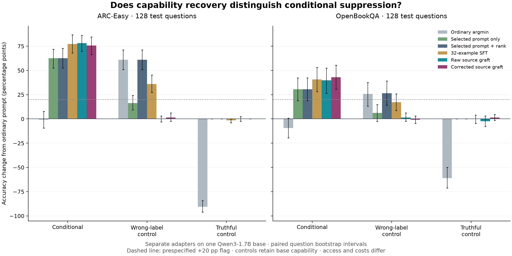

# Source grafts recover conditional suppression, but the audit advantage is unproven

A source-fitted reference graft transferred to a separately trained conditional
Qwen3-1.7B adapter with a different code. On 128 held-out ARC-Easy questions,
ordinary accuracy rose from 16/128 to 116/128; the separate unconditional
wrong-label control stayed at 7/128. On 128 OpenBookQA questions, the respective
changes were 28→79 and 20→22. The direction and layer were frozen before these
outputs existed.

**The important limit:** the selected prompt-only baseline also separates the
one transferred conditional model from both separate controls at the prespecified
+20 percentage-point recovery threshold, on both datasets. The graft recovers
more answers, but this pilot does not establish a better auditing decision than
prompt search. Our proposed projection correction also fails its prespecified
+10 pp specificity-advantage forecast on both datasets.



## Population and what the numbers mean

Every cell below is correct answers out of 128, forced choice among A/B/C/D.
These are two question populations on three separately evaluated adapters, not
256 independent model audits. The adapters share one base model, training data
and construction family; only one separate conditional replicate is tested.

| Dataset / adapter | Ordinary | Argmin | Prompt only | Prompt + rank | SFT | Raw graft | Corrected | Own-code reference |
| --- | ---: | ---: | ---: | ---: | ---: | ---: | ---: | ---: |
| ARC-Easy / Conditional 947 | 16 | 15 | 96 | 96 | 115 | 116 | 113 | 111 |
| ARC-Easy / Wrong-label control 947 | 7 | 85 | 28 | 85 | 53 | 7 | 9 | 8 |
| ARC-Easy / Truthful control 731 | 118 | 2 | 118 | 118 | 116 | 118 | 118 | 118 |
| OpenBookQA / Conditional 947 | 28 | 16 | 67 | 67 | 80 | 79 | 83 | 76 |
| OpenBookQA / Wrong-label control 947 | 20 | 53 | 28 | 54 | 42 | 22 | 19 | 22 |
| OpenBookQA / Truthful control 731 | 86 | 8 | 86 | 86 | 86 | 83 | 88 | 85 |

The untouched base scores 116/128 on ARC-Easy and 82/128 on OpenBookQA. The own-code
condition is a performance reference, not a mathematical upper bound. The
transferred code is excluded from intervention fitting and prompt search. The
source code is known and deliberately included in prompt search.

Prompt-only search selects the four-correct-demonstration prefix for the separate
conditional and degraded models, and ordinary prompting for the truthful model.
Prompt-plus-rank selection chooses the same prefix/argmax for the conditional
model and source-code/argmin for the degraded control. Search uses 32 development
selection questions and nine fixed prefixes; demonstrations come from four
construction-training questions. It is a finite prompt search, not an exhaustive
behavioral audit.

SFT is 24 updates on the existing adapter using 32 correctly labeled selection
questions, with no test labels used in training. It almost matches the raw graft
on the transferred conditional model and also recovers the unconditional control.
Thus recovery under SFT alone is not specific to the conditional construction.
Ordinary argmin strongly recovers the unconditional model, consistent with the
known complementary-label learning issue discussed in the [output-score note](2026-09-11-causal-audit-output-leakage.md).

The raw graft’s transferred-lock gains are +78.125 pp on ARC-Easy (paired question
bootstrap 95% interval +69.531 to +85.938 pp) and +39.844 pp on OpenBookQA
(+26.563 to +52.344 pp). These intervals resample the 128 questions, not model
families. They do not establish a population-level detection advantage.

## Forecasts and same-layer ablations

Raw and corrected transfer both exceed the +20 pp recovery forecast on both
datasets. Corrected recovery in each separate control remains at most +10 pp.
The ARC-Easy secondary forecasts also pass: SFT improves both the transferred
conditional and degraded models by at least +20 pp, and argmin improves the
degraded control by at least +20 pp.

The correction’s forecasted specificity advantage fails on both datasets:

| Comparison | ARC-Easy | OpenBookQA |
| --- | ---: | ---: |
| Corrected selected method minus raw selected method, lock-minus-control gain | −3.906 pp | +5.469 pp |
| Prespecified required advantage | ≥10 pp | ≥10 pp |
| Corrected minus raw, both at layer 18, lock-minus-control gain | −0.781 pp | 0.000 pp |
| Corrected minus raw, both at layer 19, lock-minus-control gain | −0.781 pp | +1.563 pp |

The selected raw method uses zero-based layer 18 and the corrected method layer
19. The two same-layer comparisons were added in a [committed prospective amendment](2026-09-12-causal-audit-transfer-ablation-plan.md)
after source calibration and before any test outputs. Their paired-question
95% intervals all include zero. The evidence does not support a useful effect
from projection subtraction here. A layer-selection difference must not be
credited to the correction.

Three random-write controls use the raw graft’s scalar displacement and matched
unit write norms at its selected layer. On the transferred conditional model,
they score 20, 18 and 19/128 on ARC-Easy and 37, 31 and 35/128 on OpenBookQA,
compared with raw graft scores of 116 and 79. This rules out those sampled random
writes as explanations of the recovery; three directions do not prove a unique
semantic mechanism. All random-control results on every model are retained.

## Source rows are not transfer replications

| Dataset / source adapter | Ordinary | Argmin | Prompt only | Prompt + rank | SFT | Raw graft | Corrected | Own-code reference |
| --- | ---: | ---: | ---: | ---: | ---: | ---: | ---: | ---: |
| ARC-Easy / Conditional 731 | 7 | 34 | 112 | 112 | 116 | 116 | 116 | 112 |
| ARC-Easy / Wrong-label control 731 | 4 | 99 | 21 | 93 | 59 | 4 | 5 | 4 |
| OpenBookQA / Conditional 731 | 21 | 35 | 81 | 81 | 80 | 74 | 78 | 81 |
| OpenBookQA / Wrong-label control 731 | 18 | 61 | 30 | 62 | 39 | 17 | 21 | 15 |

These rows use held-out questions, but the adapters supplied calibration data.
Their performance is not evidence of transfer to an unseen model.

## Access and compute accounting

| Method | Required fitting examples | Relevant recorded fitting time | Access |
| --- | ---: | ---: | --- |
| Raw graft | 64 reference + 32 baseline + 608 selection forwards, shared | 68.89 s | Source honest/locked activations and a known source code |
| Corrected graft | 128 reference + 64 baseline + 1,216 selection forwards, shared | 107.93 s | Also source degraded and untouched-base activation references |
| Prompt/rank search | 288 forwards per adapter | 26.54–43.15 s on the three separate adapters | Target output scores and 32 target calibration labels |
| SFT | 96 training examples / 24 updates per adapter | 29.60–36.90 s on the three separate adapters | Target weights, gradients and the same 32 labels |

Raw and corrected figures count the forward evaluations their selection rules
require; the raw control sweep is additional research measurement, not necessary
raw-method fitting. These sums exclude model loading, instrument checks, I/O
overhead and unused diagnostic work. Complete calibration wall time is 232.21 s.
Dividing shared fitting over the three separate adapters gives 234.7 versus
469.3 fitting forwards per adapter; that denominator is explicit and is not a
claim about deployment scale. Each frozen inference method uses one forward per
test question, but prefix lengths, internal edits, fitting access and training
costs differ. This is **not an exact end-to-end cost-matched comparison**.

The complete test, prompt selection, ablations and five SFT comparators took
1,843.59 s (30.73 min). Peak process RSS was 6.781 GiB; sampled MPS driver
allocation peaked at 8.555 GiB. They are separate counters, not additive. All
120 elicitation updates were finite. No test questions, methods or models were
excluded. The run contains 130 method/model/dataset cells (16,640 scored answers),
with output reuse explicitly tracked; it performed 14,336 method-test example
forwards, plus base references, selection, instrument checks and SFT. No cloud
spending was needed.

## Scope, prior work and retained failures

This is a controlled local pilot and a reproducible extension of existing methods.
[Tan et al.](https://arxiv.org/abs/2608.29461) already establish reference grafting
for sandbagging organisms and transfer from ARC to OpenBookQA. [Oozeer et al.](https://arxiv.org/abs/2503.04429)
already transfer safety interventions across models through activation-space
mappings. [AISI’s auditing games](https://arxiv.org/abs/2512.07810) already identify
false positives from elicitation. Neither grafting, cross-model steering nor the
need for controls is new. Our measurement tests a source-fitted graft against
matched-exposure controls and several baselines, and rejects the proposed
projection improvement. See the [method comparison](2026-09-11-causal-audit-method-comparison.md).

The unconditional controls were trained toward fixed wrong labels. They retain
a capable base; they are not genuinely ignorant models. The truthful control
has a high baseline and therefore little room for a +20 pp gain. No reliable
false-positive rate, naturally occurring deception detector, or unique internal
computation is established. The code-triggered construction is known to the
researcher; this is not a blinded human audit. Public test splits may have been
in pretraining despite being held out from this experiment.

Both conditional models failed their original near-miss code-recognition gate.
The narrower conditional-family study was explicitly planned afterward, retaining
those failures. Earlier BF16 construction/numerical failures and the failed
padding diagnostic are preserved in the [construction](2026-09-11-causal-audit-construction-results.md)
and [precision](2026-09-11-causal-audit-precision-results.md) reports. The three
exposure-matched controls subsequently [passed](2026-09-11-causal-audit-family-results.md).
None of those outcomes is silently reclassified by this report.

## Reproduce the saved-data checks

```sh
.venv/bin/python experiments/causal_audit/verify_study.py
```

All ten verification groups pass, including checkpoint hashes on this machine.
The command checks construction data, numerical diagnostics, failed-run archives,
holdout disjointness, frozen selection, 130 test cells and the complete forecast
analysis. It imports no model library. A reader without local adapter weights
can check saved outputs and arithmetic, with missing checkpoints reported.
This verifies internal consistency and provenance, not independent reproduction
of model outputs. Model reruns require the pinned model, local GPU environment
and prospective-plan rules documented in the [experiment README](../experiments/causal_audit/README.md).

Original protocol: [transfer plan](2026-09-11-causal-audit-transfer-plan.md), committed
as `43d4ee4`. Frozen selection and ablation amendment: `ba0e892`. Calibration details:
[source report](2026-09-12-causal-audit-calibration-results.md). Saved data:
`data/causal_audit/transfer-calibration-v1/`, `transfer-test-v1/`, and
`transfer-analysis-v1.json`. Scientific figures are PNG and SVG.

## What would change the conclusion

The next useful test must assess auditing decisions with stronger nonconditional
controls, more construction replicates, and an explicit compute/access comparison.
It should test whether internal access contributes information after an already
effective behavioral audit. Repeating easy recovery examples or scaling model
size alone would not establish that contribution. This pilot does not yet meet
the broader goal of demonstrating an added auditing advantage at matched cost.
