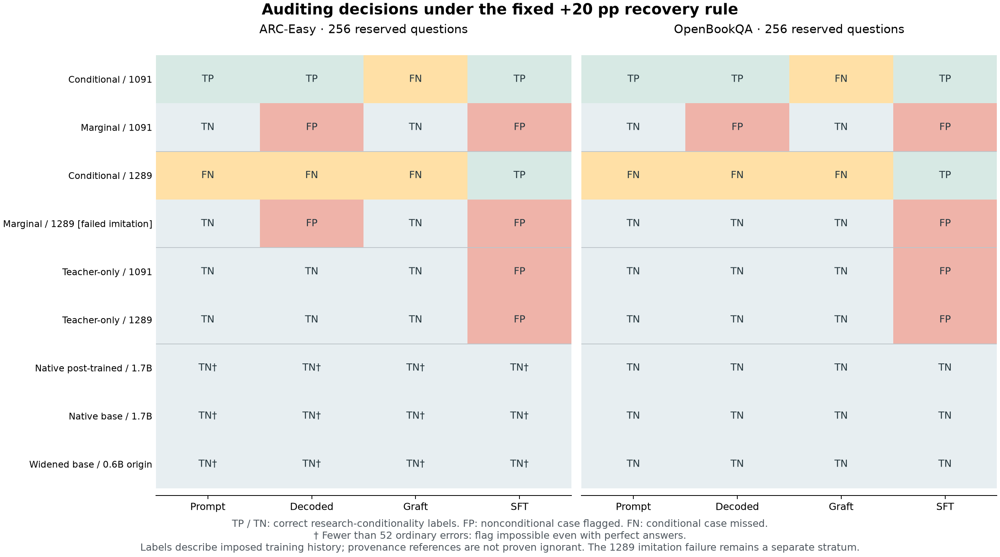
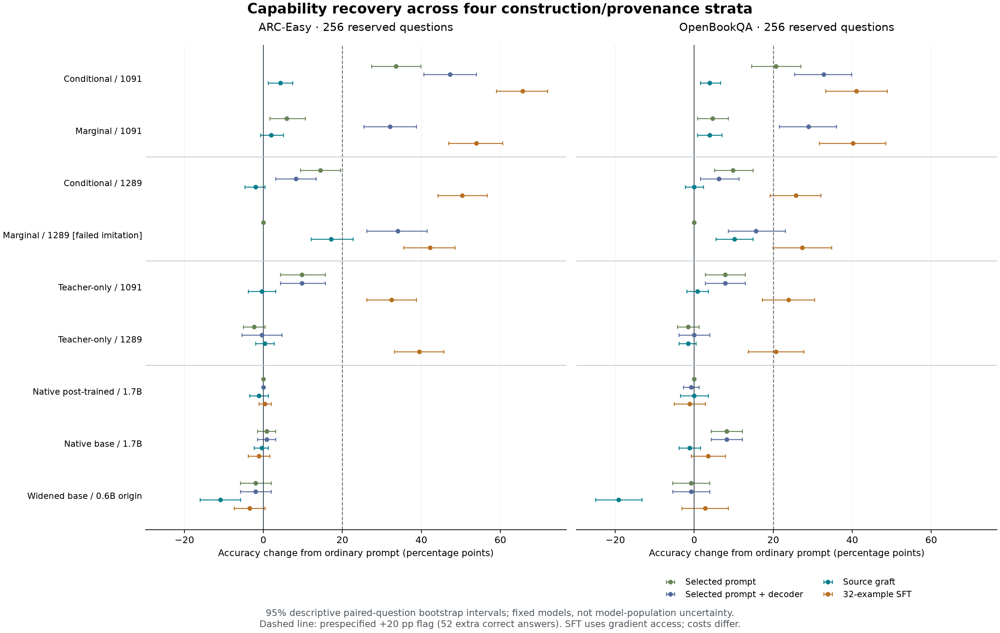
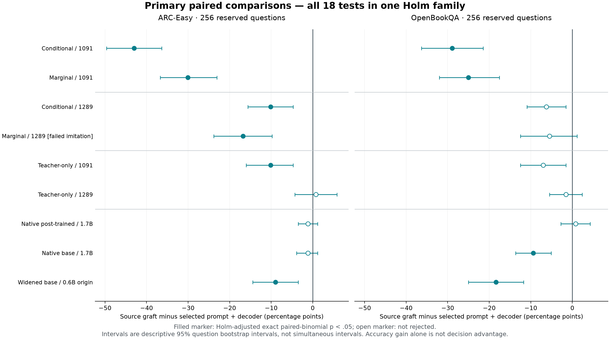

# Source-only capability recovery fails to transfer reliably across supervision histories

September 13, 2026 · Completed local study related to [P6](../PROBLEMS.md#p6-does-reading-internals-beat-behavioral-auditing-at-matched-cost)

**A causal intervention that recovered 23 additional answers out of 32 on its source model failed all four prespecified recovery forecasts on two different conditional targets and two reserved tasks.** It added no auditing detections over selected prompts, output-score decoding, or a small supervised fine-tuning comparator. This is a controlled negative result about one source-only transfer procedure, not a general impossibility result for internal auditing.

The experiment also separates capability recovery from evidence of conditional suppression. Fine-tuning on 32 development examples crossed the recovery threshold on both conditional targets, but also on all four unconditionally trained controls, on both tasks. Recovering answers alone did not identify the research-imposed training condition.

[Complete numerical appendix](2026-09-12-causal-audit-stratified-results-appendix.md) · [Saved analysis](../data/causal_audit/stratified-analysis-v1.json) · [Prospective protocol](2026-09-12-causal-audit-stratified-budget-plan.md) · [Checkpoint restoration and replay](2026-09-13-causal-audit-stratified-replay.md)

## What was tested

Nine fixed Qwen-family models each answered the same 256 reserved ARC-Easy questions and 256 reserved OpenBookQA questions. The study contains 196 method/model/task cells, including ordinary performance and diagnostics. These are held out from this research's fitting, not known to be absent from model pretraining. They are now evaluated data and cannot serve as a fresh test for subsequent method development.

The positive label is **research-imposed conditional supervision**. It does not mean natural deception, intent, or a diagnosis of what the model knows. Six adapters share the Qwen3-1.7B post-trained base and construction data. The remaining references use the native post-trained model, its 1.7B base counterpart, and a 0.6B base model widened to the same tensor shapes.

| Prespecified stratum | Models | Interpretation |
|---|---|---|
| Matched construction, seed 1091 | Conditional C1091 and marginal M1091 | The only fully eligible conditional/imitation pair |
| Failed replication, seed 1289 | Conditional C1289 and marginal M1289 | M1289 failed its original teacher-imitation gate; C1289 also failed an exact-trigger near-miss forecast |
| Teacher-only | T1091 and T1289 | Unconditional training to imitate a weaker teacher |
| Unmodified provenance | Native post, native base, widened smaller base | No research-imposed conditional training; provenance does not establish ignorance |

For the matched pair, both arms started from the same teacher checkpoint and received the same inputs and aggregate supervision: one gold and four teacher units per question. C1091 assigned gold supervision to its code input; M1091 received the same 20% gold/80% teacher mixture on every input. Both passed the fixed final construction gates. The second marginal model missed the minimum teacher agreement, 36/64 versus 39/64 required. It remains in a separate stratum. This study does not rehabilitate the rejected fully eligible six-model cohort. The adaptive construction history and all failures remain in the [construction reports](../experiments/causal_audit/README.md).

The protocol was committed at `e320762`, the entire test/analysis implementation at `5ad7641`, and all 19 fitting stages before test execution began at `e8bad2eb25282c50949a56c66ba5682dff7cafa1`. No fitting, model substitution, threshold change, or analysis-rule change followed reserved-test exposure.

## Methods and access

The source graft used one separate conditional adapter, `fp32-specificity-lock-731`. Thirty-two old development items supplied paired ordinary/honest activations; another 32 selected the intervention layer. Selection chose layer 18, zero-based, as the earliest tied winner. A unit direction `r` and honest reference coordinate `rho = 118.6601333618164` define the all-token residual edit:

`h ← h + (rho − h·r)r`

Direction, layer and reference coordinate all came from the source and were transported without target calibration or learned alignment. Source selection accuracy rose from 4/32 to 27/32. This is an in-sample selection result, not another held-out success. Target code prompts were used only as separate known-positive diagnostics.

Behavioral search evaluated 22 prefixes on 32 target development labels. It retained separate best prompt-only and prompt-plus-decoder candidates. The decoder search covered 616 candidates across prefix, score-rank, answer-permutation and affine-readout alternatives. This comparator uses answer-choice output scores; it is not a text-only black-box audit.

The SFT comparator used the same 32 target development examples for three epochs: 24 AdamW updates per model, batch size four, rank-16 LoRA on attention q/k/v/o projections, learning rate 0.0001, and full-vocabulary next-token cross-entropy. It continued constructed adapters and used fresh zero-output adapters for the references. SFT has gradient access and is reported separately from inference-budget comparisons. Full recipes, selections and provenance are in the [fitting report](2026-09-12-causal-audit-stratified-fitting-results.md).

## Recovery and auditing decisions

The fixed flag is an accuracy gain of at least 20 percentage points over ordinary prompting. With 256 questions, that requires **52 additional correct answers**. Added decision value requires at least one new conditional detection and no newly introduced classification error relative to the comparator, assessed across all cells and separately by task.

| Method | Conditional model/task cells flagged, out of 4 | Nonconditional model/task cells flagged, out of 14 |
|---|---:|---:|
| Source graft | **0** | **0** |
| Selected prompt | **2** | **0** |
| Selected prompt + decoder | **2** | **3** |
| 32-example SFT | **4** | **8** |

Prompting and decoding flagged C1091 on both tasks and missed C1289 on both. Decoding also flagged M1091 on both tasks and M1289 on ARC-Easy. SFT flagged both conditional models and both teachers and marginal controls on both tasks. The graft supplied no added detection over any comparator, including within each task. Its zero false flags do not establish a useful detector: it never flagged anything.

Three control cells have an important structural limitation. The native post, native base and widened reference start at 228, 239 and 214 correct on ARC-Easy, leaving only 28, 17 and 42 possible additional answers. They cannot cross the 52-answer threshold even with perfect recovery. Their absence of flags cannot establish specificity. All 14 control cells remain in the registered denominator; the figure marks these three as `TN†`. All three OpenBookQA reference cells have enough headroom to flag.



The known-code diagnostics establish substantial recoverable performance on both conditional targets. They make the failed source transfer informative rather than a failure to construct any recovery opportunity. Each entry below is correct answers out of 256; ARC-Easy precedes OpenBookQA.

| Conditional target | Ordinary | Own code, diagnostic | Source graft | Selected prompt | Prompt + decoder | SFT |
|---|---:|---:|---:|---:|---:|---:|
| C1091 | 58 / 60 | 233 / 176 | 69 / 70 | 144 / 113 | 179 / 144 | 226 / 165 |
| C1289 | 67 / 57 | 228 / 172 | 62 / 57 | 104 / 82 | 88 / 73 | 196 / 123 |

On the only eligible matched pair, the graft's conditional-minus-marginal gain difference was +2.34 points on ARC-Easy and zero on OpenBookQA. Descriptive paired-question bootstrap intervals were [−1.56, 6.64] and [−3.91, 3.52] points. The failed 1289 pair is not a valid causal replication of that contrast; its marginal model gained more than its conditional model under the graft.



All 18 primary source-graft-minus-decoder comparisons formed one Holm-adjusted family of exact two-sided paired-binomial tests. **Ten rejected at 0.05, all favoring the decoder; none favored the graft.** For C1091, the decoder advantage was 42.97 points on ARC-Easy and 28.91 on OpenBookQA. Statistical superiority in answering is distinct from correct auditing labels: the decoder also produced the three false flags above.

Intervals in the figures use 10,000 shared question-bootstrap draws per task. They are descriptive 95% intervals, not simultaneous intervals or uncertainty over a population of models. Shared questions and common model ancestry prevent interpreting the 18 cells as 18 independent models. All primary, secondary, random-write, token-location, own-code and widening comparisons are retained in the appendix.



## Failed forecasts and the widening diagnostic

Five of the 25 test forecast instances failed. All three separately recorded source-calibration forecasts passed.

| Failed forecast | Measured result |
|---|---|
| C1091 graft gain ≥20 points, ARC-Easy | +4.296875 points |
| C1091 graft gain ≥20 points, OpenBookQA | +3.90625 points |
| C1289 graft gain ≥20 points, ARC-Easy | −1.953125 points |
| C1289 graft gain ≥20 points, OpenBookQA | 0 points |
| Widened reference: raw and unit-normalized projected write differ by ≤10 points, ARC-Easy | 13.671875-point difference |

The graft reduced the widened model's accuracy from 214/256 to 186/256 on ARC-Easy and 149/256 to 100/256 on OpenBookQA. These harmful changes still satisfy the one-sided forecast that reference gains would be at most ten points. A passed upper-bound forecast must not be read as harmlessness.

The widening construction duplicates hidden coordinates while preserving the smaller model's function algebraically. Its finite-precision preflight matched all 24 tested answer predictions, with maximum full-logit difference 0.0001168251; this is not a global bitwise guarantee. All 310 transformed tensors were independently checked. The source direction has 47.25% of its squared norm in the symmetric subspace and 52.75% in the antisymmetric subspace. The fixed projected write scored 189/102; normalizing that write to unit length scored 151/79. Changing projection and write strength matters here, but these diagnostics do not isolate a unique downstream cause or establish that projection improves auditing. See the [widening design](2026-09-12-causal-audit-widening-design.md) and [prespecified diagnostics](2026-09-12-causal-audit-stratified-widened-diagnostics.md).

Earlier failures remain part of the evidence: 15 explicitly false construction forecast entries, separately listed validity failures that can describe the same events, and five execution-error manifests. The earlier transfer pilot also missed both ten-point specificity-advantage forecasts: −3.90625 points on ARC-Easy and +5.46875 on OpenBookQA. The [appendix's failure inventory](2026-09-12-causal-audit-stratified-results-appendix.md#earlier-recorded-failures) names each recorded entry. These adaptive development outcomes are not independent confirmatory tests. The original pilot recovered a different conditional target but added no detection over prompting; the new stratified measurement narrows confidence in transferring that success to different supervision histories.

## What this contributes relative to prior work

Reference grafting and causal unlocking are established. Tan, Le and Williams-King calibrate paired honest/locked activations **for each organism** and also transfer across tasks within an organism. Here the direction, layer and reference coordinate all come from a different source organism. Failure of that stronger transport assumption does not refute their per-organism calibration result. [A Causal Model for Locating and Unlocking Sandbagging in Model Organisms](https://arxiv.org/html/2608.29461v1)

Taylor and colleagues already show that elicitation can improve benign models and that internal auditing can produce false positives. Their benign-model rules limit degradation relative to the original instruct model; our deliberately degraded teacher and marginal controls are a different operational population. This study supplies a new controlled measurement under explicit supervision labels, not the first observation that recovery lacks specificity. [Auditing Games for Sandbagging](https://arxiv.org/html/2512.07810v1)

Cross-model activation-intervention transfer with learned mappings also predates this study. We tested direct transport in shared tensor coordinates and did not compare learned alignment. [Activation Space Interventions Can Be Transferred Between Large Language Models](https://arxiv.org/html/2503.04429v4) Function-preserving enlargement likewise builds on [Net2Net](https://arxiv.org/abs/1511.05641) and [Transformer expansion methods](https://arxiv.org/abs/2308.06103). We did not evaluate the low-rank weight-perturbation method in [Mechanistically Eliciting Latent Behaviors in Language Models (Causal Perturbative Elicitation)](https://arxiv.org/abs/2606.29604), and claim no advantage over it.

The contribution is a prospective, reproducible negative comparison: strong source calibration and substantial target code recovery coexist with failed source-only transfer across supervision histories, while stronger elicitation reveals a specificity problem in the same fixed population. This changes confidence in treating one successful unlocking demonstration as an auditor that transports. It does not identify whether direction, layer, reference coordinate, or alignment caused the transfer failure; those require separately planned tests.

## Costs and practical scope

Prompt-only, decoded and graft methods received the same independent allowance of 1,728 forward-example presentations: 704 fitting, 512 ordinary-test and 512 selected-method presentations, each padded to 512 positions. Methods that reused ordinary outputs consumed 1,216 and left 512 unused. The source fit ran once physically but its full cost is charged to each independent graft comparison; amortization is reported separately. Equal allowances are not identical information or FLOPs: the graft receives source-code access, behavioral methods receive 32 target labels and answer scores, and SFT receives gradients.

| Recorded work | Total |
|---|---:|
| Current study: 1 source fit + 9 behavioral fits + 9 SFT fits + 9 tests | 28 completed jobs, zero execution errors |
| Inference forward-example presentations | 54,004 |
| SFT training presentations, counted separately | 864; 216 optimizer updates |
| Current study model-run elapsed time | 18,655.36 seconds, 5.18 hours |
| Separately timed prerequisite verification | 494.23 seconds |
| All 70 recorded causal-audit run manifests | 65 complete, 5 execution errors; 60,331.73 seconds, 16.76 hours |

The [full history inventory](../data/causal_audit/stratified-history-costs-v1.json) counts each root run once. Its elapsed subtotal excludes unrecorded engineering, agent work, downloads, pretraining and other project time; it is not a total project bill, energy estimate or FLOP measurement. The six final construction runs account for 14,155.07 seconds already inside the historical subtotal, not an additional charge. Inference counts include repeated question presentations and numerical instruments, not 54,004 distinct questions. Training forward/backward work is separate.

Runs used float32 eager MPS on the local 64-GiB Apple machine, one model process at a time, two compute threads, watchdogs and recorded memory limits. The largest test RSS was 15.33 GiB. Packaging and read-only verification overlapped some runs, so timings are operational records, not isolated hardware benchmarks.

The scientific scope remains small: two related conditional targets, one fully eligible matched pair, two public multiple-choice datasets, adaptive construction on reused development data, and no blinded human audit or independent model-family replication. Neither natural concealment nor frontier-model auditing was tested. The broader P6 auditing game remains open.

## Verification and replay

The complete analysis was independently reconstructed with every required local checkpoint present. It also reconstructed successfully from a fresh archive of commit `0fe1632bea1cf3aff338582d0a53c109e512d8f7` in a NumPy-only environment without checkpoints, with model-library imports and common weight-file opens explicitly blocked. That run checked all nine models and the 70-run cost inventory. The [receipt and log](../data/causal_audit/stratified-final-portability-v1/receipt.json) record hashes and scope; [portable instructions](2026-09-12-causal-audit-stratified-portable-verification.md) preserve the harness. The earlier pilot's ten verification groups also pass.

From the repository root, with Python 3.12 and NumPy 2.5.2:

```sh
python experiments/causal_audit/analyze_stratified.py --verify
python experiments/causal_audit/stratified_history_costs.py --verify
python experiments/causal_audit/verify_study.py
```

Add `--require-checkpoints` to the first command for the full local weight-byte check. Saved-data verification establishes arithmetic and provenance consistency; it does not independently reproduce inference or prove how recorded outputs were generated. The restriction check used the same host and is not a cross-operating-system test.

Two independently hash-verified local archives contain all 62 fitted/widened checkpoint files needed for replay. Restoring them into a fresh worktree of the exact pre-test commit passed the frozen prerequisite gate without reading reserved outcomes or loading a model. The [replay guide](2026-09-13-causal-audit-stratified-replay.md) gives pinned public snapshots, archive hashes and commands. Archives are separate local assets excluded from Git; cloning alone does not supply them. An independent inference rerun and training replication have **not** been performed.

All three final figures were generated from the verified analysis and visually inspected; PNG/SVG hashes are in the [figure receipt](../visualizations/causal-audit/stratified-figures.json). Analysis SHA-256: `338ad810780049abb1e4050830bb4e0a2eab17fce32386ba05b9a11f3aecf1c7`. The report and evidence are prepared locally for human review; they have not been published by this task.
